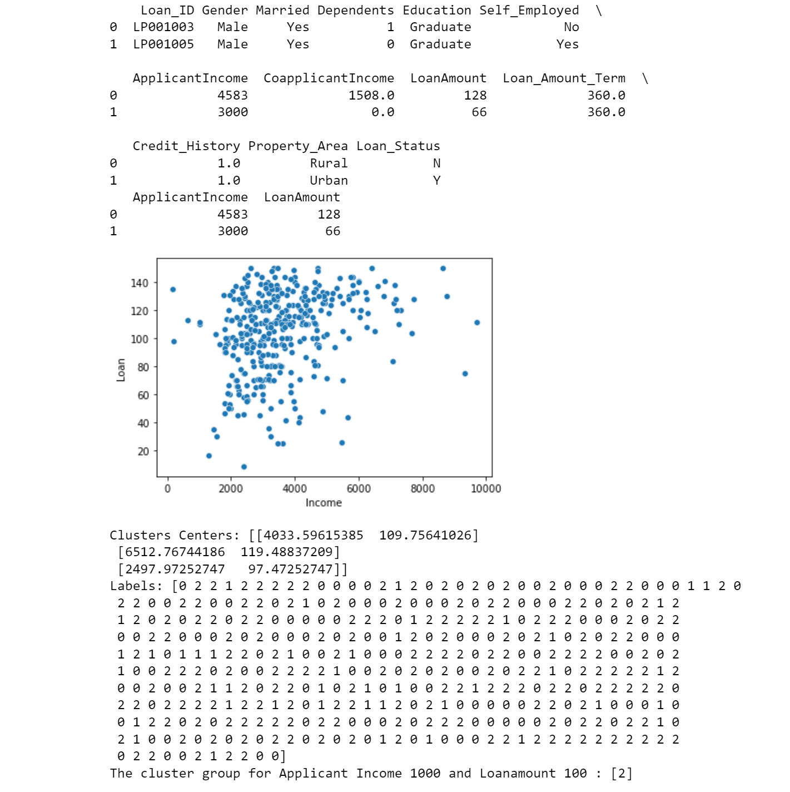

# Implementation of K-Means Clustering Algorithm
## Aim
To write a python program to implement K-Means Clustering Algorithm.
## Equipment’s required:
1.	Hardware – PCs
2.	Anaconda – Python 3.7 Installation

## Algorithm:

## Step1
Import pandas.

## Step2
Read the file using read_csv.

## Step3
Plot the points using sns.scatterplot.

## Step4
Display the number of rows.

## Step5
Predict the class using .predict and print.

## Program:
```
Developed by Swathika G
   REGISTER NO:21500231

import pandas as pd
import matplotlib.pyplot as plt
from sklearn.cluster import KMeans
import seaborn as sns
import warnings
warnings.filterwarnings('ignore')

x1 = pd.read_csv('clustering.csv')
print(x1.head(2))
x2 = x1.loc[:, ['ApplicantIncome','LoanAmount']]
print(x2.head(2))

x = x2.values
sns.scatterplot(x[:,0], x[:,1])
plt.xlabel('Income')
plt.ylabel('Loan')
plt.show()

kmean =KMeans(n_clusters=3)
kmean.fit(x)

print('Clusters Centers:', kmean.cluster_centers_)
print('Labels:', kmean.labels_)

predicted_class = kmean.predict([[1000,100]])
print('The cluster group for Applicant Income 1000 and Loanamount 100 :' ,predicted_class)
```

## Output:

### Insert your output



## Result
Thus the K-means clustering algorithm is implemented and predicted the cluster class using python program.